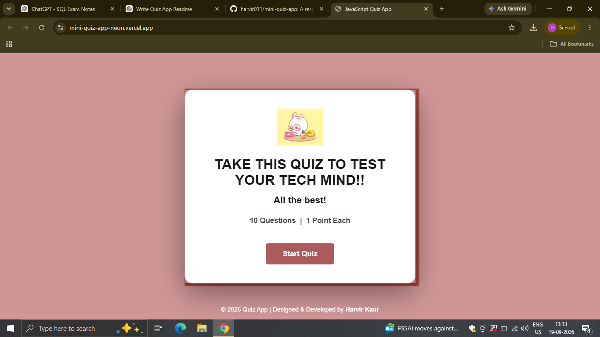
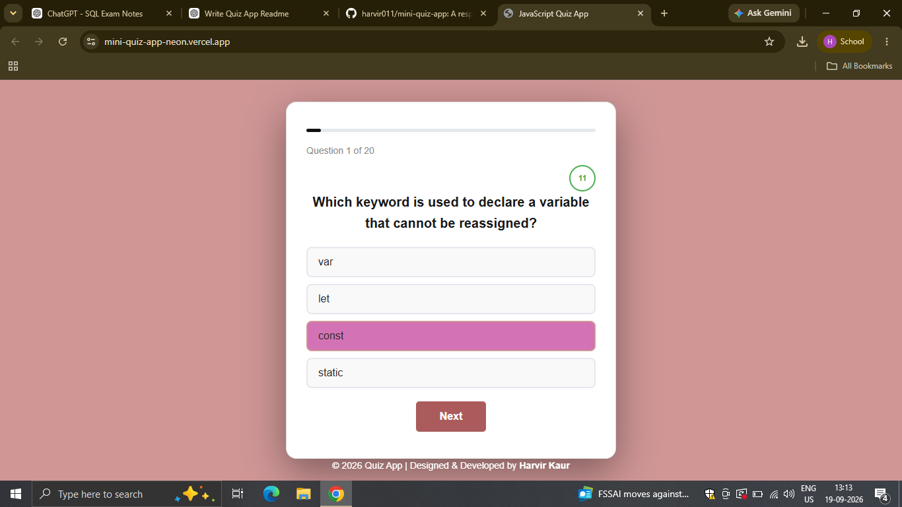
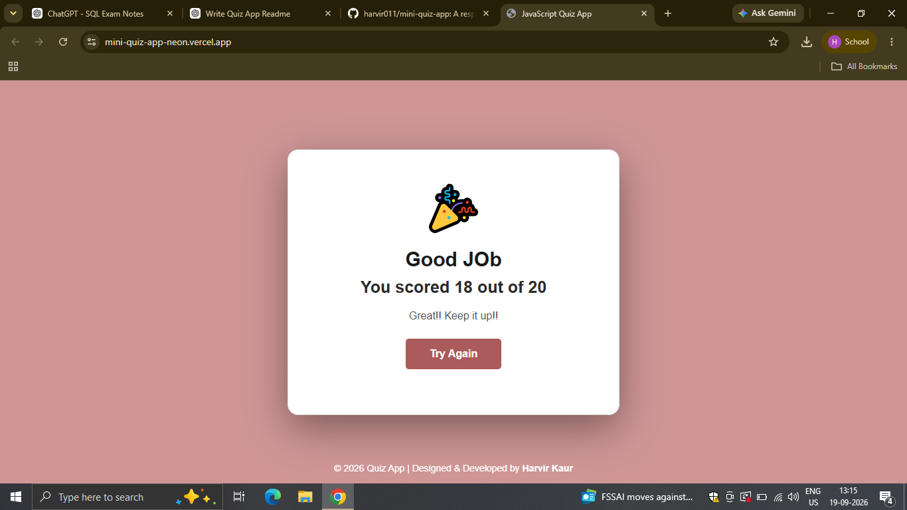

# 🧠 Mini Quiz App

<p align="center">
  
</p>

<p align="center">
  <b>Think • Choose • Score!</b>
</p>

## 📌 About

**Mini Quiz App** is a fun and interactive quiz application where users can answer multiple-choice questions and test their knowledge. The app features a cute visual design, attractive banners, and JPG images for a more engaging experience.

## ✨ Features

* 🎯 Multiple-choice quiz questions
* 🧠 Interactive quiz experience
* 📊 Automatic score calculation
* 🏆 Displays the final score
* 🔄 Restart quiz option
* 🎨 Cute and attractive UI
* 🖼️ Custom banners and JPG images
* 📱 User-friendly and responsive design

## 🛠️ Technologies Used

* **HTML5** – Structure of the application
* **CSS3** – Styling, layout, animations and design
* **JavaScript** – Quiz logic, answer checking and score calculation
* **JPG/PNG** – Banners and visual assets

## 📂 Project Structure

```text
Mini-Quiz-App/
│
├── index.html
├── style.css
├── script.js
│
├── images/
│   ├── banner.jpg
│   ├── quiz.jpg
│   ├── result.jpg
│   └── other-images.jpg
│
└── README.md
```

> **Note:** Change the image filenames above to match the actual names of your images.

## 🎮 How to Play

1. Open the Mini Quiz App.
2. Click **Start Quiz**.
3. Read each question carefully.
4. Select the answer you think is correct.
5. Continue through all the questions.
6. View your final score.
7. Restart the quiz and try again!

## 📸 Screenshots

### 🏠 Home Page

<p align="center">
  
</p>

### 📝 Quiz Page

<p align="center">
  
</p>

### 🏆 Result Page

<p align="center">
  
</p>

## 🚀 Future Improvements

* Add different quiz categories
* Add difficulty levels
* Add a countdown timer
* Add a leaderboard
* Save high scores using Local Storage
* Add more questions
* Add sound effects and animations
* Add more interactive elements

## 👩‍💻 Author

**HARVIR**

A mini project created to practice **HTML, CSS and JavaScript** by building a fun and interactive quiz application.

## 📄 License

This project is created for **educational purposes**.

